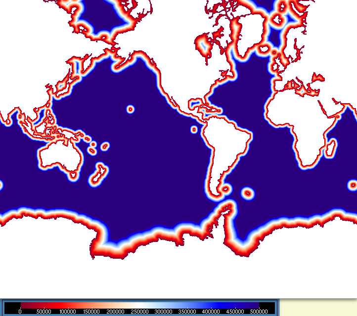
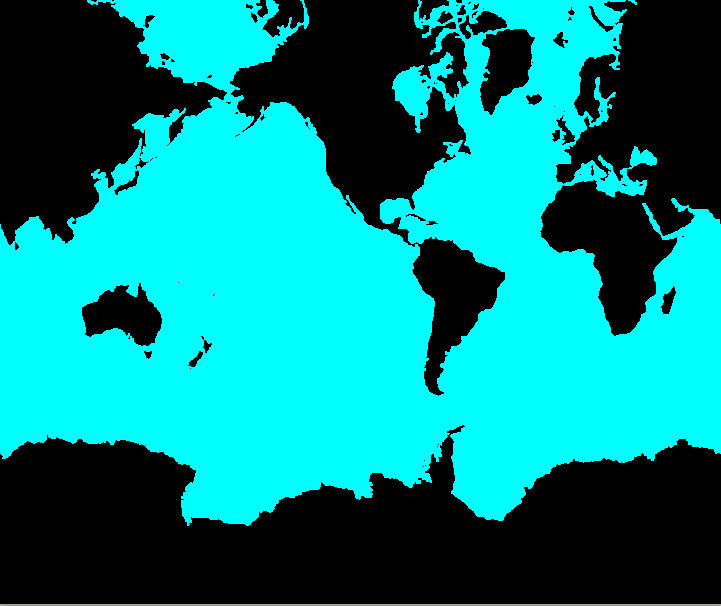

# Building distcoast file
## from mask :

   ```
   cdfcofdis  -H eORCA05.L121_mesh_mask.nc  -M eORCA05.L121_mesh_mask.nc -nc4 -o eORCA05_discoast_v1.nc -surf
   ```


## from runoff file :

   ```
   cdfcofdis  -H eORCA05.L121_mesh_mask.nc  -M eORCA05_runoff_ISBA_CLIM_3.5.nc -rnf   -nc4 -o eORCA05_disrunoff_v1.nc 
   # masking made the file easier to visualize (but formally not reauired by NEMO). 
   cdfmltmask -f eORCA05_disrunoff_v1.nc -v Tcoast -p T -m eORCA05.L121_mesh_mask.nc
   ```

## Comments :

On the images below, we show the 2 files obtained from the 2 previous procedures, left for the mask generated file, right for the runoff generatred file.

mask | runoff
:---:|:---------------:|
 | 

On these figures, the colors are saturated for distances greater than 500 km. Main differences come from islands or archipelagoes without runoff 
(South Orkneys islands, Kerguelen Island, Faroes Island ... ).    
Apart from these islands, we also notice that semi enclosed seas (Med Sea, Black Sea, Red Sea etc ...), due to their reduced size, can be almost ignored by the SSS
restoring. In fact, atmospheric precip are not very much trusted on these regions and SSS restoring may avoid spurious drift in there. Therefore, local
modifications must be done on the files, for instance by artificially increasing the value of the distance.  As an example, we will set all Med Sea, Black Sea Red Sea distances to a very high value (says 5000 km) to prevent SSS fading off on these areas. This can be done using `cdfvar`:

```
rm -f eORCA05_disrunoff_v1.nc.01* eORCA05_disrunoff_v1.nc.02* eORCA05_disrunoff_v1.nc.03*


# Med Sea Black Sea Red Sea
cdfvar -f eORCA05_disrunoff_v1.nc -v Tcoast -zoom 574 665 370 459 -sz 5000000 
cdfvar -f eORCA05_disrunoff_v1.nc.01 -v Tcoast -zoom 564 582 412 438  -sz 5000000 
# Persian Gulf
cdfvar -f eORCA05_disrunoff_v1.nc.02 -v Tcoast -zoom 666 689 388 413  -sz 5000000 
cdfmltmask -f eORCA05_disrunoff_v1.nc.03 -v Tcoast -p T -m eORCA05.L121_mesh_mask.nc

```

(these lines are gathered in [distcoast_correct.sh](./distcoast_correct.sh) that can be used as a template for other corrections.)  
The resulting disrunoff file is shown on next figure; The corrected semi-enclosed seas have now a very high distance to the coast.  Note that
according to SSS analysis for a given configuration on can iterate on this file for a better control on the restoring.


## An alternative:
Instead of correcting the resulting distcoast file, one may work with a modified tmask, for instance eliminating the islands from the mask.
Modification of the surface tmask can be achieved with BMGTOOLS (which requires some work on the input files in order to make them compliant
with the tool:
  * data file must be x,y only (noz, no time).
  * variable to edit should be named `Bathymetry`, and should **NOT** be of `byte` type.

On the following picture, the modified surface tmask is shown. Small islands have been suppressed. Big differences in the Indonesian Throughflow area.



The resulting distoast file is shown on the next figure :


